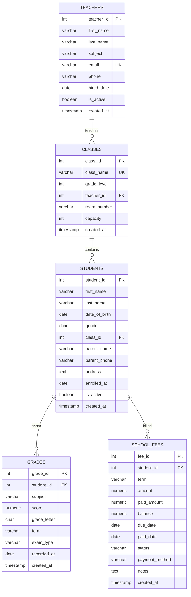
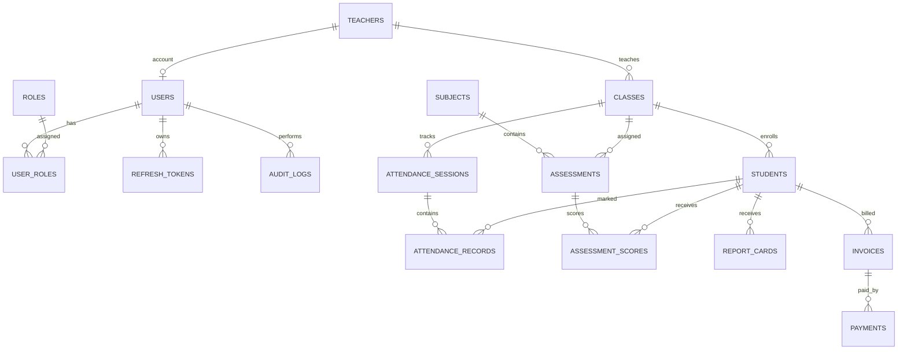

# Database Design

## Current Schema

Current tables:

- `teachers`
- `classes`
- `students`
- `grades`
- `school_fees`

The current schema is a useful prototype, but it needs to become migration-driven and include the security, audit, attendance, academic, and finance tables required by the product vision.

## Current ERD

## Target Schema Additions

Security:

- `users`
- `roles`
- `user_roles`
- `refresh_tokens`

Audit:

- `audit_logs`

Academic:

- `subjects`
- `assessments`
- `assessment_scores`
- `report_cards`

Attendance:

- `attendance_sessions`
- `attendance_records`

Finance:

- `invoices`
- `payments`

Shared fields:

- `created_at`
- `updated_at`
- `deleted_at`
- `created_by`
- `updated_by`

## Target ERD

## Migration Strategy

Adopt Alembic before adding new schema work.

Initial migration order:

1. Baseline existing schema.
2. Add auth tables.
3. Add audit logs.
4. Add shared audit fields and soft-delete fields.
5. Normalize academics.
6. Add attendance.
7. Split finance into invoices and payments.
8. Add reporting support tables if persisted report snapshots are needed.

## Indexing Strategy

Keep existing foreign-key indexes and add indexes based on access patterns:

- Student search: lower-cased name fields or trigram index if full-text search is required.
- Enrollment filters: `students(class_id, is_active, enrolled_at)`.
- Attendance analytics: `attendance_sessions(class_id, attendance_date)` and `attendance_records(student_id, status)`.
- Grade analytics: `assessment_scores(student_id, assessment_id)` and `assessments(term, subject_id)`.
- Finance summaries: `invoices(student_id, status, due_date)` and `payments(invoice_id, paid_at)`.
- Audit logs: `audit_logs(actor_user_id, created_at)` and `audit_logs(resource_type, resource_id)`.

## Transaction Rules

Use transactions for:

- Creating users with roles.
- Creating or updating students with class capacity checks.
- Recording payments and updating invoice state.
- Recording grades and report-card aggregates.
- Mutating business actions that also write audit logs.
